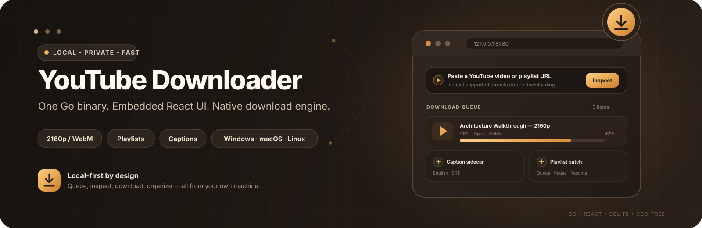

<p align="center">
  
</p>

# YouTube Downloader

YouTube Downloader is a local Windows, macOS, and Linux web application for saving YouTube videos and playlists that you own or are permitted to download. One Go executable starts the local API, serves the embedded React interface, and opens it in your browser. With the default `ADDR`, the URL is `http://127.0.0.1:8080`; changing `ADDR` changes the URL.

Use it only for content you own or have permission to save, and in accordance with YouTube's terms. The application does not support DRM, private-video credentials, browser cookies, paywall bypasses, or live/HLS/DASH recording.

## Download and run on Windows

Download the Windows archive from [GitHub Releases](https://github.com/ajbergh/yt-dl-go/releases/latest), extract it, and double-click `youtube-downloader.exe`. Keep the console window open while using the app. The UI connects automatically to the Go API in that same executable; there is no service address to configure. If the browser does not open, visit the URL printed in the console (normally `http://127.0.0.1:8080`).

The executable includes the web UI and Go download engine. It does not embed a web browser. For the automatic adaptive-HD path (including 1080p where YouTube makes a compatible stream available), install Chrome, Chromium, or Microsoft Edge. Normal browser discovery is automatic. If needed, point to a specific browser:

~~~
$env:CHROME_PATH = 'C:\Program Files\Google\Chrome\Application\chrome.exe'
.\youtube-downloader.exe
~~~

Downloads are stored in `downloads` under the process's current working directory (normally beside the executable when it is launched directly). Open the UI, paste an approved YouTube URL, choose a maximum quality and video-format strategy, confirm your rights, and download. `best`, `2160`, `1440`, `1080`, `720`, and `480` are maximum heights—not upscale requests or guarantees. Video format can be **Best quality**, strict **Compatibility MP4** (H.264/AAC), **Prefer VP9**, or **Prefer AV1**. VP9/AV1 preferences fall back to the automatic best-supported format when the preferred codec is unavailable and disclose that fallback in the job note. The actual height and MIME type are shown for each completed file.

## Linux and macOS

The same CGO-free Go application builds for Linux and macOS. CI produces Linux `amd64`/`arm64` and macOS `amd64`/`arm64` validation packages with SHA-256 checksum files. These CI artifacts are currently unsigned; they are not yet signed/notarized public release binaries.

On macOS the app uses `open` for browser/folder navigation and `osascript` for the native folder chooser. On Linux it uses `xdg-open`; the Settings **Browse** button additionally requires `zenity`, but an absolute output path can always be entered manually. For browser-assisted adaptive HD, install a compatible Chrome/Chromium browser or set `CHROME_PATH` explicitly.

See [docs/PACKAGING.md](docs/PACKAGING.md) for artifact names, architecture targets, runtime integration details, and the signing/notarization plan.

After inspection, you can optionally choose an available caption language and save it as a WebVTT (`.vtt`) or SubRip (`.srt`) sidecar. Caption extraction is best-effort: if a selected language is unavailable for one playlist item or YouTube's timed-text request fails, the media download still succeeds and the Library records a caption warning. Published sidecars are written next to their media file; app-managed sidecars are included in whole-job ZIP downloads.

## How HD downloads work

YouTube commonly serves HD and 4K video as separate adaptive video and audio tracks. The Compatibility MP4 strategy is strict: it selects progressive MP4 or adaptive H.264/AAC MP4 and never silently emits WebM. Best quality keeps the automatic policy. VP9 preferred and AV1 preferred select the requested WebM codec when available under the quality ceiling and otherwise fall back to the automatic best-supported format with an explicit job note. For 1440p/2160p, VP9/AV1 video is paired with Opus audio and remuxed into WebM entirely in Go, without transcoding or FFmpeg. When YouTube requires browser-scoped authorization, the app launches a temporary headless Chrome-compatible session, targets the selected codec/quality, captures only the selected tracks through their declared final fragments, and discards the temporary browser profile when the download ends.

The app does not ask you to provide an account token or import cookies from your normal browser profile. YouTube may issue short-lived authorization to the temporary browser session used for adaptive capture; that profile is discarded when the download ends. This is separate from the Go API's optional `API_TOKEN` setting: the built-in UI does not prompt for or send that token, so leave `API_TOKEN` unset when using the bundled UI. If adaptive HD cannot be completed, the app uses the highest verified compatible progressive MP4 when available and records that fallback in the job note. YouTube availability and delivery rules can change, so no downloader can promise a particular resolution for every video.

## Build and package

Requirements:

- Go 1.26 or newer
- Node.js and npm to rebuild the embedded React UI
- Internet access on the build machine to download Go and npm dependencies

From the repository root in PowerShell, build the UI first, copy it into the Go embed directory, then build the executable. Vite empties root `dist` on each build, removing any existing executable and other files there. Do not use root `dist` as `DATA_DIR`; keep download data outside the build-output directory. Build the executable last.

The checked Windows build workflow is available as:

~~~powershell
.\scripts\build-windows.ps1
.\scripts\package-windows.ps1 -ExecutablePath .\dist\youtube-downloader.exe
~~~

Linux/macOS packages use the shared Unix build script:

~~~bash
TARGET_OS=linux TARGET_ARCH=amd64 bash ./scripts/build-unix.sh
TARGET_OS=darwin TARGET_ARCH=arm64 bash ./scripts/build-unix.sh
~~~

Both packaging paths include the README and third-party notices and produce SHA-256 checksum files. The Unix script can also cross-build the alternate `amd64`/`arm64` architecture because the Go backend is built with `CGO_ENABLED=0`.

It validates the toolchain and installed frontend dependencies, rebuilds the UI directly into the Go embed directory, runs the Go tests with CGO disabled, and verifies the resulting executable. It does not replace `node_modules`, so a running dev server will not lock files needed by the build. If dependencies are missing, close the app or Vite dev server, run `npm ci`, then retry. The workflow leaves other files in root `dist` intact. Pass `-OutputPath` to choose a different executable destination.

~~~
npm ci
npm run build
New-Item -ItemType Directory -Force .\src\server\dist | Out-Null
Copy-Item -Path .\dist\* -Destination .\src\server\dist -Recurse -Force

Push-Location .\src\server
go mod download
go test ./...
$env:CGO_ENABLED = '0'
go build -buildvcs=false -trimpath -ldflags='-s -w' -o ..\..\dist\youtube-downloader.exe .
Pop-Location
~~~

On Windows the executable result remains `dist\youtube-downloader.exe`. Unix package names include the target OS and architecture. `CGO_ENABLED=0` keeps the Go program self-contained; Chrome remains an external runtime dependency only for browser-assisted adaptive HD downloads.

### Releases and update checks

Tagged stable releases use `.github/workflows/release.yml`. A tag must use `vMAJOR.MINOR.PATCH` form **and exactly match `package.json`**. The workflow runs the full frontend/Go/browser validation suite, builds the Windows/Linux/macOS package matrix, verifies each archive checksum, creates a canonical `SHA256SUMS.txt`, attaches GitHub build-provenance attestations, and creates a **draft** GitHub Release. Draft releases are intentionally invisible to update discovery until a human completes the publication gate.

Release builds embed immutable `version`, source commit, and build-date metadata through Go linker variables. Local/ordinary CI builds remain `dev / unknown`. The Settings page shows this metadata, and packaged binaries can report the same identity without starting the service:

~~~text
youtube-downloader --version
~~~

Release builds perform a non-blocking check of the repository's latest stable **published** GitHub Release. Development builds skip that external request entirely.

Update discovery is advisory only. The app links to the validated GitHub Release when a newer stable version exists; it does **not** download or replace its own executable. Automatic self-update remains disabled until Windows Authenticode signing, macOS Developer ID/notarization, post-download verification, and rollback-safe replacement are implemented. See [Release and update policy](docs/RELEASES.md) for the draft publication, provenance, signing, and rollback gates.

## Configuration

All settings are optional environment variables. The default loopback configuration is suitable for a single local user.

| Variable | Default | Purpose |
| --- | --- | --- |
| `ADDR` | `127.0.0.1:8080` | Listener address |
| `DATA_DIR` | `./downloads` | Directory for private job files |
| `CHROME_PATH` | unset | Explicit Chrome/Chromium/Edge executable path |
| `API_TOKEN` | unset | Bearer token for protected API routes. The bundled UI sends no token; leave unset when using the executable's UI. |
| `ALLOWED_ORIGINS` | Own loopback listener origin; Vite origins in `dev` builds | Exact comma-separated HTTP(S) origins accepted by CORS; release builds require an explicit setting for cross-origin access |
| `ALLOWED_HOSTS` | Loopback authorities at the listener port | Additional exact `host[:port]` values accepted by the host check |
| `MAX_JOBS` | `32` | Maximum queued, downloading, processing, and paused jobs; finished Library records do not count |
| `MAX_JOB_BYTES` | `10737418240` | Per-job media byte limit (10 GiB) |
| `JOB_TIMEOUT` | `6h` | Whole-job deadline |
| `RETENTION` | `never` | Keep finished Library records by default. An explicit duration of at least `5m` expires a record only when every finalized file has a verified published copy. Failed or cancelled jobs with no files are cleaned after 24h by default. |
| `NO_BROWSER` | unset | Backward-compatible environment switch; set to `1` to suppress automatic UI browser launch |

### Background / no-browser mode

The packaged executable normally starts the local service and opens its embedded UI in your default browser. For long-running or headless use, start the same executable with either supported alias:

```
youtube-downloader --background
youtube-downloader --no-browser
```

Both modes keep the Go service and download workers running in the foreground process but suppress automatic browser launch. Open the logged local URL (normally `http://127.0.0.1:8080/`) whenever you want the UI. Stop the service with the normal process signal / Ctrl+C. `NO_BROWSER=1` remains supported for CI and older automation.

This is intentionally **not** a detached daemon or native system-tray process: the foreground lifetime keeps shutdown/recovery behavior explicit and avoids invisible orphan services.

For a network-visible deployment, set a random `API_TOKEN` of at least 32 characters, exact `ALLOWED_ORIGINS`, and exact `ALLOWED_HOSTS`; place the service behind TLS and appropriate network controls. The built-in UI cannot authenticate to a token-protected API, so use an external client that can send the bearer token. This program is designed as a trusted local/single-user tool, not a public multi-tenant download service.

## Verification

Run the repeatable checks from the repository root (the UI tests use Bun; the production build uses Node/npm):

~~~
npm run typecheck
npm run build
Push-Location .\src\server
go test ./...
go vet ./...
Pop-Location
bun test .\src\downloader.test.mjs .\src\ui.test.mjs
npm run e2e:browser
~~~

The browser E2E layer builds a test-tagged deterministic Go service, drives real headless Chrome, exercises queue/pause/resume/completion/settings/restart persistence, and verifies destructive-action confirmation. The test fixture is excluded from normal production builds.

The live check is intentionally separate because it downloads real media and depends on current YouTube and browser behavior. Replace the sample URL with a video you are authorized to download and whose available quality meets the selected minimum:

~~~
Push-Location .\src\server
$env:YTDL_LIVE_DOWNLOAD_URL = 'https://youtu.be/y0KRrtfy2pY?si=ERBKJkjkY-SoPC4I'
$env:YTDL_LIVE_MIN_HEIGHT = '1080'
go test -run TestLiveDownload -count=1 -v
Pop-Location
~~~

The race detector may require a C compiler on Windows, depending on the Go toolchain and target configuration.

## Licensing

The project is licensed under MIT; third-party components retain their own licenses. Binary packages include complete Go and npm notices, license texts, and the LGPL decoder source. Each tagged release also includes a source archive with the build and relinking instructions. See [third-party notices](src/server/THIRD_PARTY_NOTICES.md) and [LGPL relinking](src/server/LGPL_RELINKING.md).

## Project guides

- [Frontend guide](src/README.md): develop, test, and embed the React UI.
- [Backend guide](src/server/README.md): service configuration, behavior, and API contract.
- [Third-party notices](src/server/THIRD_PARTY_NOTICES.md): distribution attribution and licenses.
- [Packaging guide](docs/PACKAGING.md): Windows/Linux/macOS packages, checksums, runtime integration, and signing/notarization requirements.
- [Release and update policy](docs/RELEASES.md): versioning, draft publication, provenance, native signing gates, and rollback requirements.
- [UI reference mock](dev_mock_new_ui/README.md): the supplied design mock; it is not the production UI or backend.
